# Lapres Praktikum Jaringan Komputer Modul-3 IT13
**Anggota Kelompok**

| Nama                   | NRP          |
| ---------------------- | ------------ |
| Muhammad Faishal Rizqy | `5027221026` |
| Rafif Dhimaz Ardhana   | `5027221066` |


## 1. Topologi CPT, CIDR
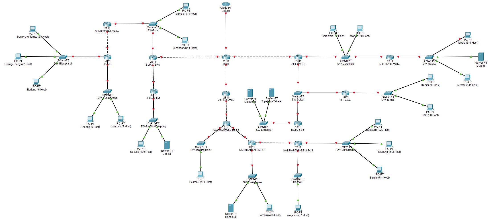

## 2. Topologi GNS, VLSM
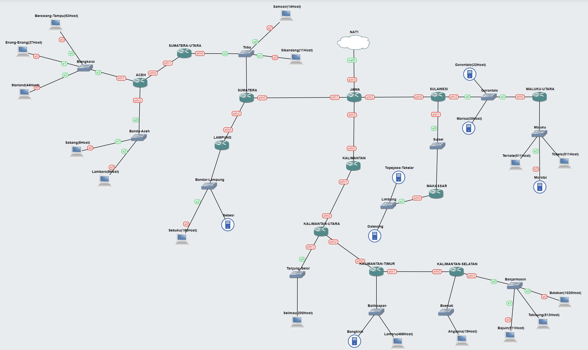

## 3. Rute
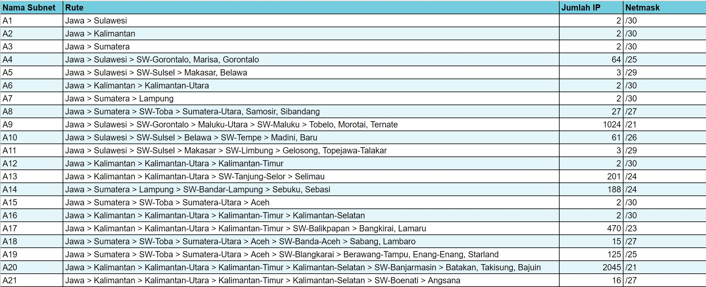

## 4. VLSM
### 4.a. Tree
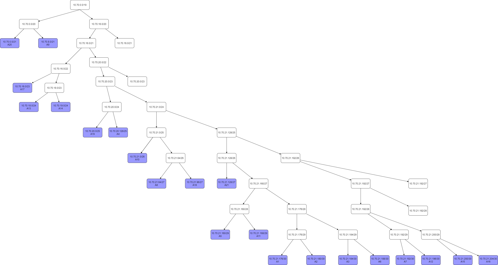
### 4.b. Pembagian IP
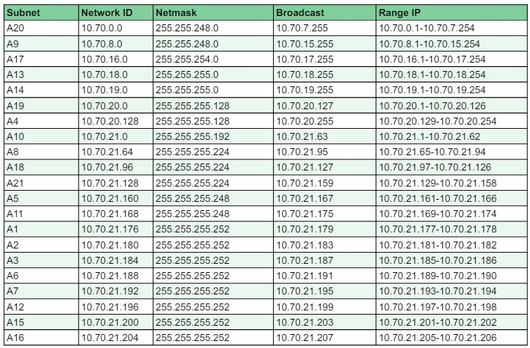
### 4.c. Network Config

`Jawa`
```bash
auto lo
iface lo inet loopback

auto eth0
iface eth0 inet dhcp

#A3
auto eth1
iface eth1 inet static
address 10.70.21.185
netmask 255.255.255.252

#A15
auto eth2
iface eth2 inet static
address 10.70.21.201
netmask 255.255.255.252

#A16
auto eth3
iface eth3 inet static
address 10.70.21.205
netmask 255.255.255.252
```


### 4.d. Routing
### 4.e. Testing

## 5. CIDR
### 5.a. Penggabungan Subnet

- Subnet Awal


- Penggabungan Subnet pertama (Subnet B)

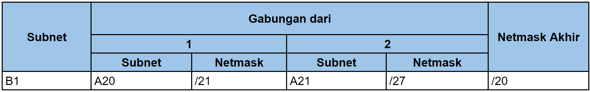

- Penggabungan Subnet kedua (Subnet C)

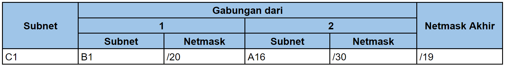

- Penggabungan Subnet ketiga (Subnet D)

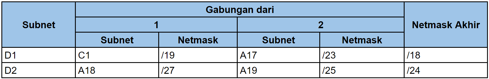

- Penggabungan Subnet keempat (Subnet E)

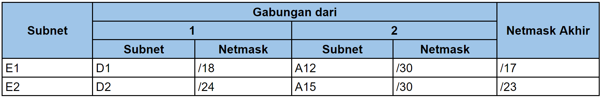

- Penggabungan Subnet kelima (Subnet F)

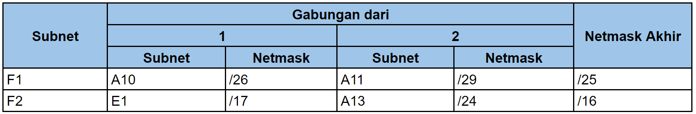

- Penggabungan Subnet keenam (Subnet G)

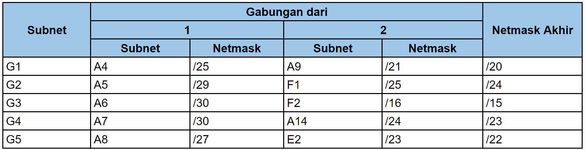

- Penggabungan Subnet ketujuh (Subnet H)

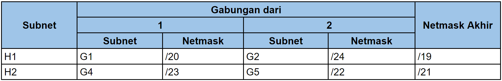

- Penggabungan Subnet kedelapan (Subnet I)

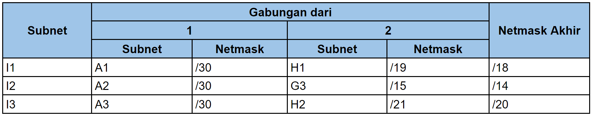

- Penggabungan Subnet kesembilan (Subnet J)

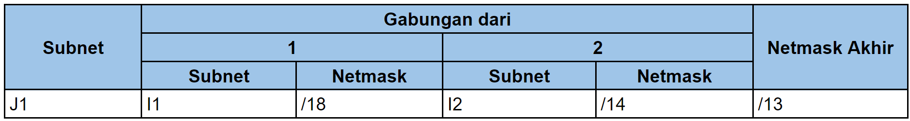

- Penggabungan Subnet terakhir (Subnet K)

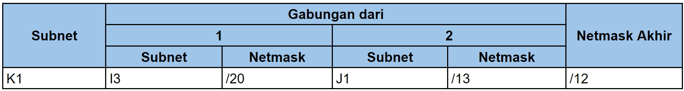

### 5.b. Tree
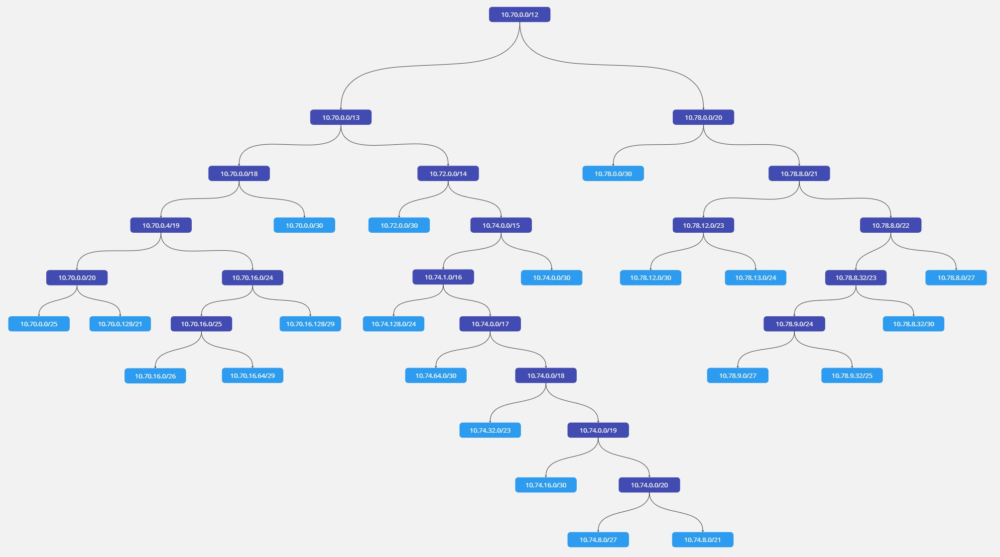

### 5.c. Pembagian IP
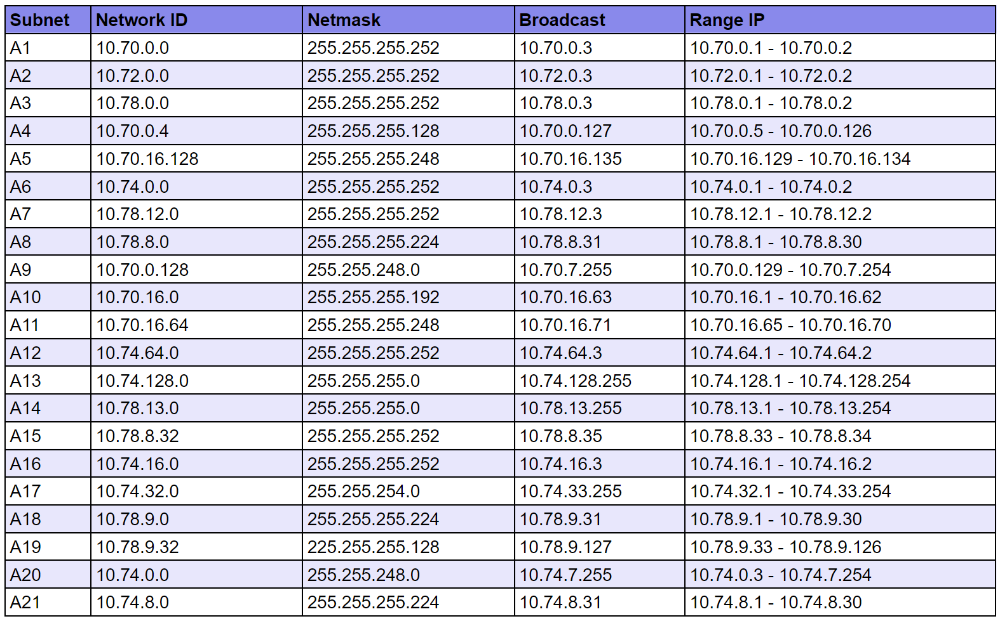

### 5.d. Testing

https://github.com/ishal24/Jarkom-Modul-4-IT13-2024/blob/main/vid/Test_CIDR.mp4